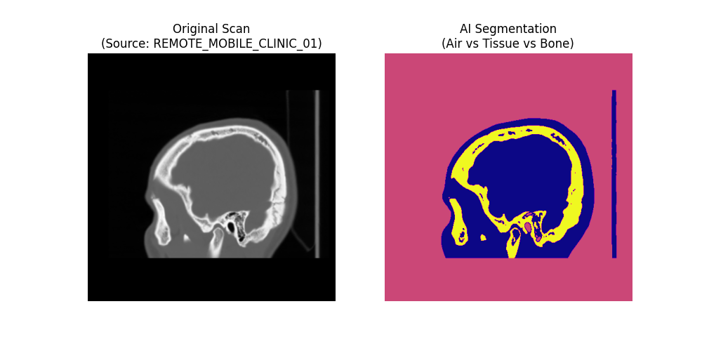

# Edge-Native DICOM Pipeline for Mobile Units 🚑 📡

### **Intelligent Triage & Resilient Upload Gateway for Remote Clinics**


## 📋 Project Overview
This project addresses the critical connectivity challenges faced by **Mobile Medical Units** (e.g., mammography trucks) operating in remote areas with unstable 4G/LTE signals.

Instead of relying on fragile, direct uploads, this **Edge-Native Gateway**:
1.  **Ingests** raw DICOM files locally.
2.  **Anonymizes** patient data (GDPR Compliance).
3.  **Analyzes** scan density using Unsupervised AI (K-Means) for instant triage.
4.  **Uploads** securely with **Exponential Backoff Retry Logic** to handle network drops without data loss.

---

## 🏗 System Architecture
The pipeline is designed to run locally on the edge (the truck) before data reaches the cloud.

> *[Insert your Architecture Diagram here - Upload 'architecture_diagram.png' to repo]*
> 

---

## ⚡ Key Features

### 1. **Resilient "Smart Upload" Protocol**
* **Problem:** 4G connections in rural Sicily/remote areas frequently drop.
* **Solution:** The `batch_processor.py` module detects connection failures and triggers an **Exponential Backoff** mechanism (pauses and retries), ensuring 100% file delivery reliability.

### 2. **AI-Powered Triage (Edge Inference)**
* **Problem:** Radiologists waste time opening blank or low-contrast scans.
* **Solution:** A lightweight **K-Means Clustering** algorithm runs locally to segment the image into **Bone, Tissue, and Air**.
* **Result:** Generates a visual "Digital Highlighter" overlay for rapid review.


*(Left: Original Raw Scan | Right: AI Segmented Output)*

### 3. **GDPR-First Privacy**
* Automatically strips sensitive DICOM tags (`PatientName`, `PatientID`) and replaces them with anonymous hashes *before* the data leaves the local network.

---

## 🛠 Technical Stack
* **Language:** Python 3.x
* **Medical Imaging:** `pydicom` (DICOM standard parsing)
* **Data Science:** `scikit-learn` (K-Means Clustering), `numpy`
* **Visualization:** `matplotlib`
* **Edge Logic:** Custom retry loops with `time` & `random` simulation.

---

## 🚀 How to Run

### Prerequisites
```bash
pip install pydicom matplotlib scikit-learn numpy
